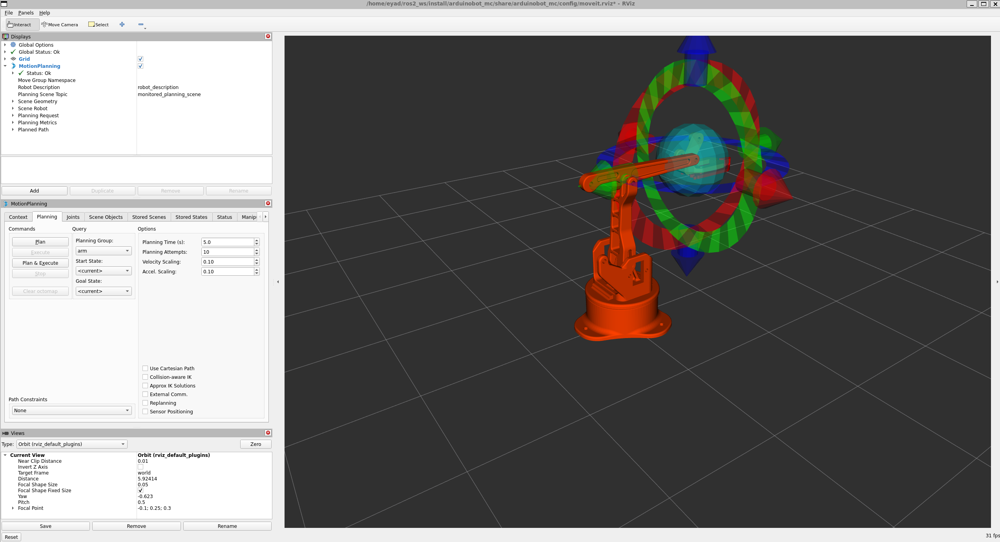
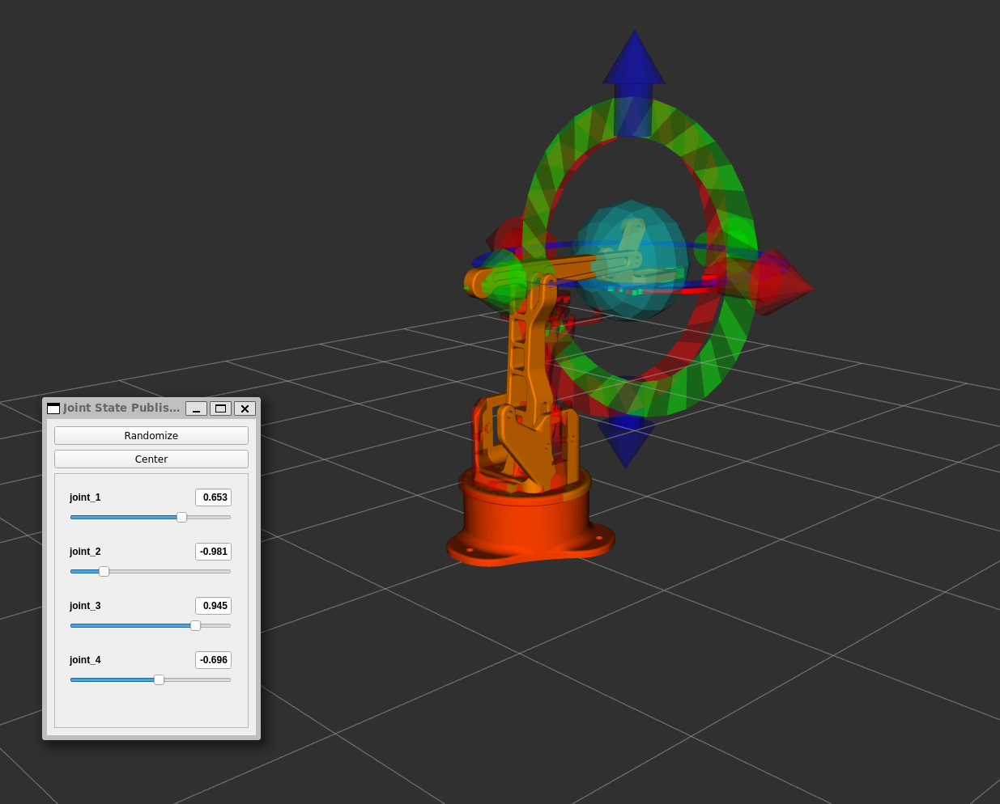
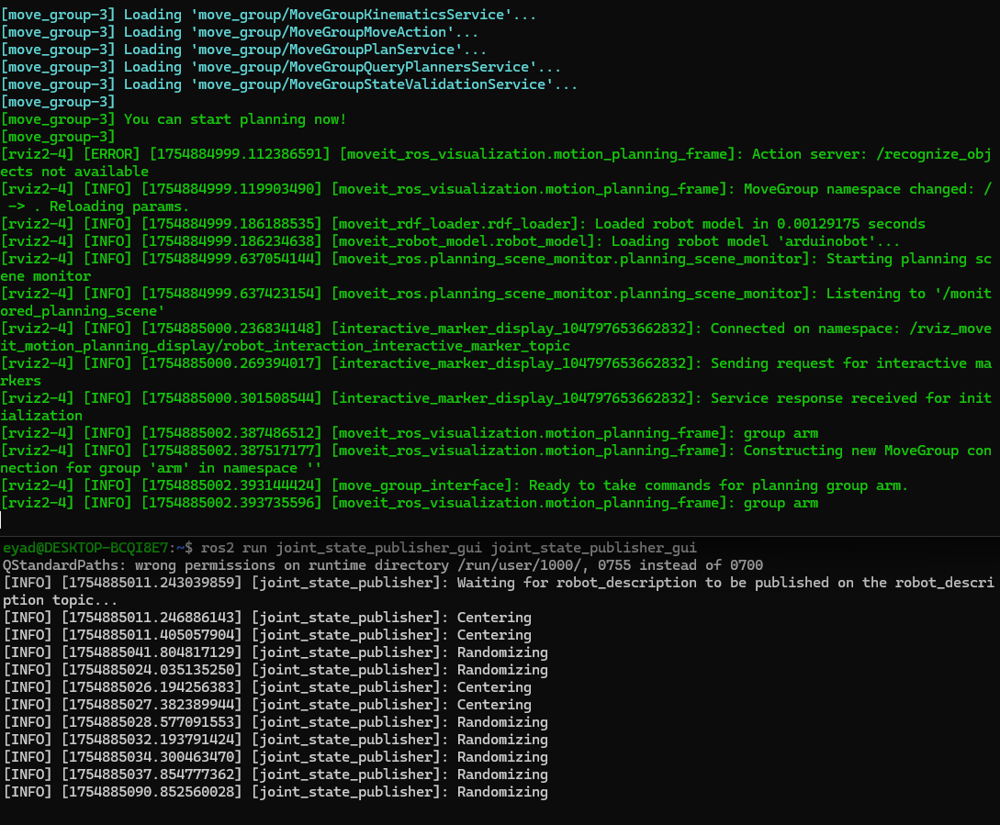

# Week 6 (AI/ROS2) — RViz Display, MoveIt Demo, Joint State Publisher GUI

## Objective
Launch the robot arm in RViz, run MoveIt demo, and control joints via GUI sliders.

## Quick Start
```bash
# 1) Setup (build Robot_Arm_ROS2)
bash setup.sh

# 2) Open 3 terminals and run:
bash run_display.sh         # RViz model
bash run_moveit_demo.sh     # MoveIt demo (motion planning)
bash run_jsp_gui.sh         # Joint State Publisher GUI (sliders)


## Screenshots





